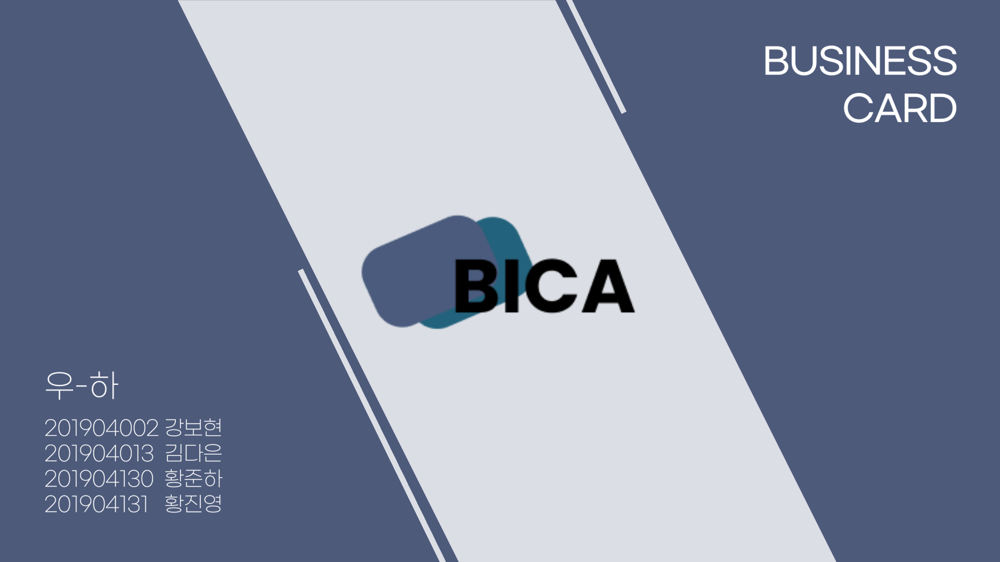

# BICA

---

- 기능
    - 명함 CRUD
    - 명함 공유(QR코드 기반)
    - 명함 글씨 인
    - 전화 수신시 명함 보여주기
    
- 역할
    - 준하
        - 명함 보여주기
        - zxing 라이브러리를 활용하여 QR코드로 명함 공유 기능
        - Material 디자인 적용
        - BroadcastReceiver를 활용하여 전화 수신시 명함 정보 띄우기

- 사용기술
    - Firebase Authentication을 이용한 회원가입 및 로그인
    - Cloud Firestore를 이용해 저장
    - ML Kit를 이용해 명함 글씨 인식
    - zxing 라이브러리를 활용하여 QR코드 인식
    - Material 기반 디자인
    - BroadcastReceiver 활용하여 전화 수신 시 명함 보여주기
    
- 아쉬운점
    - 이메일 인증
    - NFC로 공유하기
    - 명함 인식시 이미지 CROP
    - Room DB를 활용해서 오프라인 상태에서도 활용 할 수 있게 하기

---

